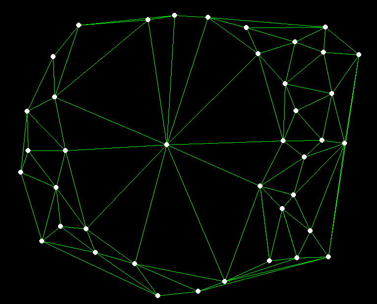

# espace_negatif
Baptiste Vié - Les 7 Doigts de la Main

## Contexte

Ce programme a été fait dans le cadre d'un prototype por BEATS, expérience immersive et intéractive adaptée aux foules. Le but ici est de détecter les cercles vides ou quasi vides qui peuvent se créer dans une foule, afin de pouvoir par la suite faire des projections aux sol en réaction à la foule. Ce programme est basé sur les données du logiciel Augmenta.

Couplé à Augmenta, il renvoit un flux NDI pouvant être par la suite utilisé par des artistes visuels.

## Installation

Cloner le repo

```bash
git clone https://github.com/baptistevie07/espace_negatif.git
cd espace_negatif
```

Créer un environnement virtuel

```cmd
# Windows
py -m venv .venv
.\.venv\Scripts\activate
```

Ou

```cmd
# Linux
python3 -m venv .venvwsl
source .venvwsl/bin/activate
```

Installer les dépendances :

```bash
pip install -r requirements.txt
```

Lancer le programme :

```bash
python main.py
```

## Fonctionnement

La détection d'espaces négatifs fonctionne grâce à trois instances fonctionnant en parallèle, elles peuvent être aussi bien utilisées sur un même ordinateur ou plusieurs, les informations se transmettant par OSC, Websocket et NDI :

- Augmenta : Processing des pointclouds pour obtenir la position de tous les clusters.
- Python ([```main.py```](./main.py)) : Recherche d'espaces négatifs par triangulation des positions des clusters, renvoit un flux ndi avec l'espace en blanc si détecté. Interface PyGame pour visualiser.
- TouchDesigner : Visualisation de la zone détectée + affichage du pointcloud pour vérifier la cohérence de la détection.

Afficher schéma des flux

### Algorithme de détection

La détection des espaces négatifs est basée sur une triangulation de Delauney : on construit un système de triangles reliant toutes les coordonnées des clusters et on en tire un certain nombre de propriétés. Tout est calculé dans [```computation.py```](./utils/computation.py). 


*Triangulation de Delaunay appliquée aux clusters détectés dans la foule.*

Après triangulation, on opère en parallèle deux types de recherche, puis on fera une expansion de la zone candidate :

- Recherche d'espaces négatifs sans personne à l'intérieur. On cherche des triangles candidats (fonction ```empty_zones```).
    - Recherche des zones candidates :

        | Critère                      | Explication                                      |
        |------------------------------|--------------------------------------------------|
        | Aire minimale              | Si > ```area_threshold```       |
    - Discrimination des zones candidates si :
    
        | Critère                      | Explication                                       |
        |------------------------------|--------------------------------------------------|
        | Moins de deux voisins proches              | Si les clusters aux sommets n'ont pas 2 voisins proches, cela veut dire qu'ils ne font pas partie d'un cercle de gens autour d'un espace négatifs. Il leur faut deux voisins à une distance inférieur de ```radius```.       |

- Recherche d'espaces négatifs avec des personnes à l'interieur. On cherche ici des sommets candidats, qui seraient les gens à l'intérieur du cercle (fonction ```personnes_centrales```).
    - Recherche des sommets candidats (il faut un critère rempli) :

        | Critère                      | Explication                                       |
        |------------------------------|--------------------------------------------------|
        | Nombre minimal de voisins              | Si un sommet a de nombreux voisins, cela peut pouvoir dire qu'il est au centre d'un cercle : il "voit" beaucoup de personnes. Il doit au minimum avoir ```n_triangles``` voisins.|
        | Nombre minimal de voisins, condition allégée | On considère que deux sommets très proches peuvent partager leur nombre de voisins, on compte donc leur nombre de voisins globaux et on vérifie la première condition. On regarde également les sommets qui sont dans le cas : ```n_triangles``` - 2 <= count < ```n_triangles```. Si ils sont reliés directement à un autre candidat qui a au moins ```n_triangles``` - 2 voisins, cela peut vouloir dire qu'il y a plusieurs personnes à l'intérieur de l'espace négatif.
    - Discrimination des sommets candidats si (une seule condition suffit à discriminer):

        | Critère                      | Explication                                       |
        |------------------------------|--------------------------------------------------|
        | Candidat trop près d'un sommet qui n'est pas candidat              | Si un candidat est proche d'un autre qui n'est pas candidat, alors il fait partie du contour de l'espace négatif et n'est pas à l'intérieur. Si il est plus près que ```distance_min```. |
        | Critère angulaire | Un candidat doit avoir des sommets tout autour de lui, si le contour autour de lui a un angle supérieur à ```angle_max``` sans personne, alors le cercle est rompu et ce n'est plus un candidat. |
        | Minimum de voisins loins | Il faut qu'un candidat ait au moins ```min_count``` voisins à une distance supérieure à ```min_dist``` (si tous ces voisins sont proches, il ne peut pas être au centre d'un cercle), on le garde quand même si un de ses voisins candidats est retenu.|
        
    Après toutes ces étapes, on crée des zones candidates composées de tous les triangles autour des sommets candidats.

On a maintenant des zones candidates issues de deux manières différentes. On va d'abord expandre ces zones car ce ne sont à priori qu'une partie de l'espace négatif. Ensuite on appliquera de nouveau critères pour discriminer ces zones.

- Expansion : On ajoute les triangles adjacents à la zone candidate si d1 + d2 < ```ratio_threshold``` x edge.

Ajouter image

- Discrimination des espaces trouvés (une seule condition suffit à discriminer) :

    | Critère | Explication |
    |-|-|
    | Pas assez de triangles dans la zone | Si < ```nb_min_region```|
    | Densité de gens autour de la zone trop faible | Si Périmètre / Nb_de_gens_autour > ```min_density``` |
    | Distance trop grande entre deux personnes du contour | Si il y a un trou dans le cercle de plus de 3 m. |
    | Trop de gens au centre par rapport aux gens autour | Si il y a moins de gens sur les contours que 4 fois ceux au centre |
    | Si il n'y a pas une forme suffisamment circulaire | Si Périmètre² > ```ratio_area``` x 4π x Aire | 


