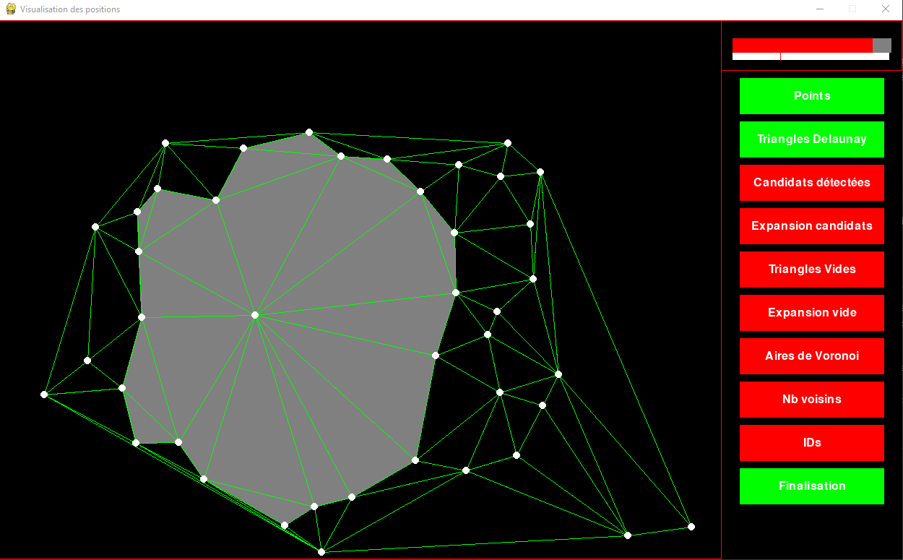

# Détection d'espaces "négatifs" dans une foule en temps réel
Baptiste Vié - Les 7 Doigts de la Main

## Contexte

Ce programme a été fait dans le cadre du prototypage de BEATS, expérience immersive et intéractive adaptée aux foules. Le but ici est de détecter les espaces vides ou quasi vides qui peuvent se créer dans une foule, afin de pouvoir par la suite faire des projections aux sol en réaction à la foule. Ce programme est basé sur les données du logiciel Augmenta.

Il renvoit une texture NDI pouvant être par la suite utilisé par des artistes visuels, ainsi qu'un flux OSC indiquant si un espace a été trouvé. Le flux est ici traité dans TouchDesigner.

|  |  |
|-|-|

*Visualisation finale : Vues verticale du nuage de points d'une foule, obtenu avec 4 caméras Orbbec, en rouge la texture de l'espace négatif détecté, malgré des gens au centre centre*

## Installation

Cloner le repo

```bash
git clone https://github.com/baptistevie07/espace_negatif.git
cd espace_negatif
```

Créer un environnement virtuel

```cmd
# Windows
py -m venv .venv
.\.venv\Scripts\activate
```

Ou

```cmd
# Linux
python3 -m venv .venvwsl
source .venvwsl/bin/activate
```

Installer les dépendances :

```bash
pip install -r requirements.txt
```

## Lancement du programme

Les programmes Python, Augmenta et TouchDesigner peuvent tourner sur des ordinateurs différents ou non. 127.0.0.1 pour rester en local.

- Dans le fichier ```main.py```, modifier l'adresse IP de l'ordinateur avec TouchDesigner, ainsi que celle de l'ordinateur Augmenta, ligne 10, par exemple :
```python
augmenta_ip = "127.0.0.1"
augmenta_port = 3335
touchdesigner_ip = "192.168.10.239"
touchdesigner_port = 3336
```
- Dans Augmenta - Backend GUI, si vous n'utilisez pas le fichier fourni dans le repo, paramétrez un output Augmenta V3, indiquez l'IP de l'ordinateur faisant tourner Python, port 3335 par défault. Activez ```Send Age```. Si l'on prend l'exemple de Beats, vous pouvez pour tester :
    - Aller sur le node Cloud Recorder 1
    - Choisir le directory avec l'enregistrement `ShowFinal26Juin22.star`
    - Choisir ensuite ce même enregistrement dans `Record file name`
    - Une loop range [0.8, 0.92] permet de se focusser sur les cercles du show
    - Play et gérer la progression grâce au slider. 
    - Pour visualiser : 127.0.0.1:8080

- Dans le fichier TouchDesigner, entrez l'adresse IP de l'ordinateur Augmenta au niveau du plugin de visualisation (```Augmentadat1```). Une fois le programme Python lancé, le flux NDI de la texture sera à l'adresse "Espace_Negatif".

Lancez le programme python :

```bash
python main.py
```

## Fonctionnement

La détection d'espaces négatifs fonctionne grâce à trois instances fonctionnant en parallèle, elles peuvent être aussi bien utilisées sur un même ordinateur ou plusieurs, les informations se transmettant par OSC, Websocket et NDI :

- Augmenta : Processing des pointclouds pour obtenir la position de tous les clusters.
- Python ([```main.py```](./main.py)) : Recherche d'espaces négatifs par triangulation des positions des clusters, renvoit un flux ndi avec l'espace en blanc si détecté. Interface PyGame pour visualiser.
- TouchDesigner : Visualisation de la zone détectée + affichage du pointcloud pour vérifier la cohérence de la détection.

## Algorithme de détection

La détection des espaces négatifs est basée sur une triangulation de Delauney : on construit un système de triangles reliant toutes les coordonnées des clusters et on en tire un certain nombre de propriétés. Tout est calculé dans [```computation.py```](./utils/computation.py). Pour la triangulation, on exclut les clusters de moins de 10 frames d'âge, qui risquent d'être un glitch. Les variables gérant les paramètres suivants sont toutes modifiables au début de main.py :
```python
# Variables de recherche (décrites ci-dessous)
n_triangles = 8
distance_min = 1.2
angle_max = 100
min_count = 2
min_dist = 3
ratio_threshold = 1.4
nb_min_region = 6
min_density = 1.5
max_dist_between_2_persons = 4.5
ratio_area = 2
min_ratio = 0.3
life_threshold = 4
```

## Visualisation
Le rendu final de la texture est en sortie du programme TouchDesigner. Une interface PyGame est disponible pour faciliter l'évaluation des détections et leurs causes. La fenètre est de cette forme :


*Interface Pygame*

Les boutons sur la droite permettent d'afficher ou non certains moment clés dans la détection des espaces négatifs. 

En haut à droite il y a deux sliders : celui en blanc est le taux de frames avec des espaces négatifs trouvés parmi les dernières 100 frames. La ligne rouge est le threshold (```min_ratio```) à dépasser pour considérer que c'est un espace négatif et pas un glitch. Celui en rouge indique le temps à attendre pour confirmer la présence d'un espace négatif. Il affiche ensuite la durée de vie de l'espace en question.

### Recherches de cœurs d'espaces négatifs

Après triangulation, on opère en parallèle deux types de recherche, puis on fera une expansion de la zone candidate :

- Recherche d'espaces négatifs sans personne à l'intérieur. On cherche des triangles candidats (fonction ```empty_zones```).
    - Recherche des zones candidates :

        | Critère                      | Explication                                      | Valeur utilisée |
        |------------------------------|--------------------------------------------------|-|
        | Aire minimale              | Si > ```area_threshold```       | 3 m² |
    - Discrimination des zones candidates si :
    
        | Critère                      | Explication                                       | Valeur utilisée |
        |------------------------------|--------------------------------------------------|-|
        | Moins de deux voisins proches              | Si les clusters aux sommets n'ont pas 2 voisins proches, cela veut dire qu'ils ne font pas partie d'un cercle de gens autour d'un espace négatifs. Il leur faut deux voisins à une distance inférieur de ```radius```.       | 3 m |

- Recherche d'espaces négatifs avec des personnes à l'interieur. On cherche ici des sommets candidats, qui seraient les gens à l'intérieur du cercle (fonction ```personnes_centrales```).
    - Recherche des sommets candidats (il faut un critère rempli) :

        | Critère                      | Explication                                       | Valeur utilisée |
        |------------------------------|--------------------------------------------------|-|
        | Nombre minimal de voisins              | Si un sommet a de nombreux voisins, cela peut pouvoir dire qu'il est au centre d'un cercle : il "voit" beaucoup de personnes. Il doit au minimum avoir ```n_triangles``` voisins.| 8 triangles |
        | Nombre minimal de voisins, condition allégée | On considère que deux sommets très proches peuvent partager leur nombre de voisins, on compte donc leur nombre de voisins globaux et on vérifie la première condition. On regarde également les sommets qui sont dans le cas : ```n_triangles``` - 2 <= count < ```n_triangles```. Si ils sont reliés directement à un autre candidat qui a au moins ```n_triangles``` - 2 voisins, cela peut vouloir dire qu'il y a plusieurs personnes à l'intérieur de l'espace négatif.
    - Discrimination des sommets candidats si (une seule condition suffit à discriminer):

        | Critère                      | Explication                                       | Valeur utilisée |
        |------------------------------|--------------------------------------------------|-|
        | Candidat trop près d'un sommet qui n'est pas candidat              | Si un candidat est proche d'un autre qui n'est pas candidat, alors il fait partie du contour de l'espace négatif et n'est pas à l'intérieur. Si il est plus près que ```distance_min```. | 1.2 m |
        | Critère angulaire | Un candidat doit avoir des sommets tout autour de lui, si le contour autour de lui a un angle supérieur à ```angle_max``` sans personne, alors le cercle est rompu et ce n'est plus un candidat. | 100° |
        | Minimum de voisins loins | Il faut qu'un candidat ait au moins ```min_count``` voisins à une distance supérieure à ```min_dist``` (si tous ces voisins sont proches, il ne peut pas être au centre d'un cercle), on le garde quand même si un de ses voisins candidats est retenu.| ```min_count``` = 2 et ```min_dist``` = 3 m |
        
    Après toutes ces étapes, on crée des zones candidates composées de tous les triangles autour des sommets candidats.

### Expansion et nouvelles discriminations

On a maintenant des zones candidates issues de deux manières différentes. On va d'abord expandre ces zones car ce ne sont à priori qu'une partie de l'espace négatif. Ensuite on appliquera de nouveau critères pour discriminer ces zones.

- Expansion : On ajoute les triangles adjacents à la zone candidate si d1 + d2 < ```ratio_threshold``` x edge.

Ajouter image

- Discrimination des espaces trouvés (une seule condition suffit à discriminer) :

    | Critère | Explication | Valeur utilisée |
    |-|-|-|
    | Pas assez de triangles dans la zone | Si < ```nb_min_region```| 6 |
    | Densité de gens autour de la zone trop faible | Si Périmètre / Nb_de_gens_autour > ```min_density``` | 1.5 m en moyenne entre deux personnes |
    | Distance trop grande entre deux personnes du contour | Si il y a un trou dans le cercle de plus de : | 4.5 m |
    | Trop de gens au centre par rapport aux gens autour | Si il y a moins de gens sur les contours que 4 fois ceux au centre | Non utilisé |
    | Si il n'y a pas une forme suffisamment circulaire | Si Périmètre² > ```ratio_area``` x 4π x Aire | 2 |

### Détection définitive d'un espace négatif

On a a priori détecté un espace négatif. Ce calcul a été fait sur une seule frame, qui peut comporter de faux clusters d'Augmenta. On va donc essayer de moyenner le résultat d'une seule frame. On procède de manière parallèle pour :

- Eviter des glitchs dans la texture finale, côté TouchDesigner. Concrètement on moyenne la texture toutes les 5 frames précédentes, pendant 10 frames. On conserve chaque pixel qui est apparu suffisamment de fois, dans ces 10 frames, en définissant un threshold.
- Définir si il y a réellement un espace négatif qui a été détecté (pour éviter de moyenner entre eux des faux-positifs), côté Python. La classe ```Life``` regarde en permanence dans les 100 dernières frames, combien ont détecté un espace négatif. Si il y a un ratio de détections positives d'au moins ```min_ratio``` (0.3), il y a de bonnes chances d'avoir un espace négatif sous les yeux. Si cette situation dure plus de ```life_threshold``` (3) secondes, c'est un espace négatif. On envoit alors à TouchDesigner par OSC que c'est un espace négatif, et il affiche sa moyenne des textures précédentes.
